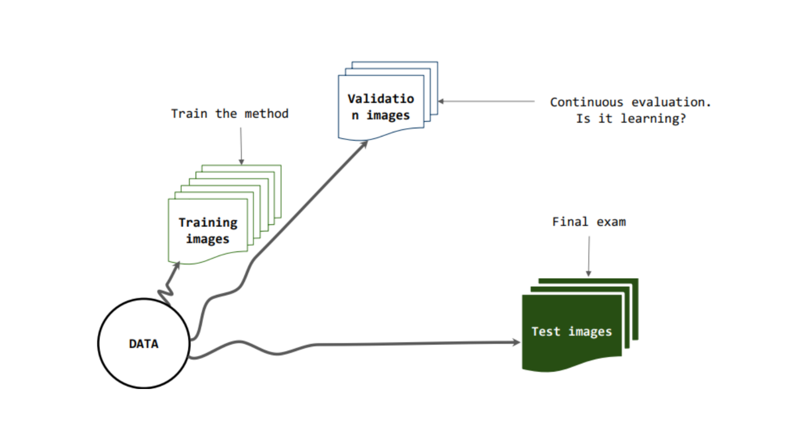

*Proc. SPIE 12527, Pattern Recognition and Tracking XXXIV, 125270P, 2023* 


🔗Paper


### Abstract: 

Corneal endothelium assessment is carried out via specular microscopy imaging. However, automated image analysis often fails due to inadequate image quality conditions or the presence of dark regions in pathologies such as Fuchs’ dystrophy. Therefore, an early reliable image classification strategy is required before automated evaluation based on cell segmentation. Moreover, conventional classification approaches rely on manually labeled data which are difficult to obtain. We propose a two-stage semi-supervised classification algorithm, feature detection and prediction of a blurring level and guttae severity that allows us to cluster images based on the degree of segmentation complexity. For validation, we developed a web-based annotation application and surveyed a pair of expert ophthalmologists for grading a portion of the 1169 images. Preliminary results show that this approach provides a reliable and fast approach for corneal endothelial cell (CEC) image classification.

### Citation:

*Sergio Sanchez, Kevin Mendoza, Fernando Quintero, Angélica M. Prada, Alejandro Tello, Virgilio Galvis, Lenny A. Romero, and Andres G. Marrugo "Deep neural networks for evaluation of specular microscopy images of the corneal endothelium with Fuchs' dystrophy", Proc. SPIE 12527, Pattern Recognition and Tracking XXXIV, 125270P (13 June 2023); https://doi.org/10.1117/12.2663895*