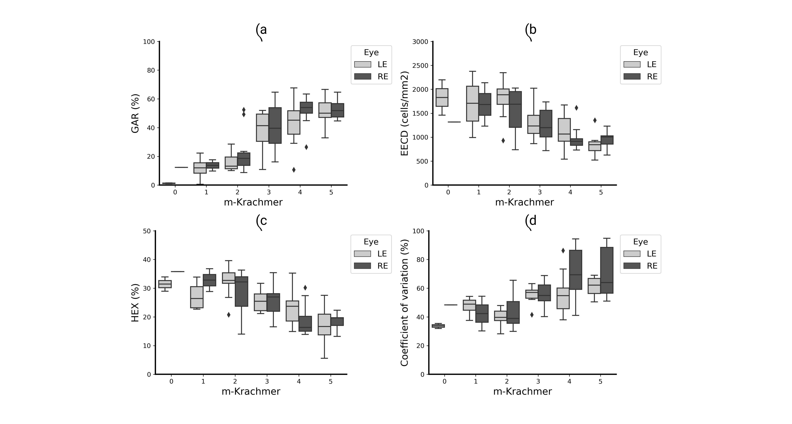

*ColCACI 2023 / Communications in Computer and Information Science, vol 1865. Springer, 2023* 


🔗Paper


### Abstract: 

**Purpose:**

The aim of this study was to evaluate the efficacy of artificial intelligence–derived morphometric parameters in characterizing Fuchs corneal endothelial dystrophy (FECD) from specular microscopy images.

**Methods:** 

This cross-sectional study recruited patients diagnosed with FECD, who underwent ophthalmologic evaluations, including slit-lamp examinations and corneal endothelial assessments using specular microscopy. The modified Krachmer grading scale was used for clinical FECD classification. The images were processed using a convolutional neural network for segmentation and morphometric parameter estimation, including effective endothelial cell density, guttae area ratio, coefficient of variation of size, and hexagonality. A mixed-effects model was used to assess relationships between the FECD clinical classification and measured parameters.

**Results:**

Of 52 patients (104 eyes) recruited, 76 eyes were analyzed because of the exclusion of 26 eyes for poor quality retroillumination photographs. The study revealed significant discrepancies between artificial intelligence–based and built-in microscope software cell density measurements (1322 ± 489 cells/mm2 vs. 2216 ± 509 cells/mm2, P < 0.001). In the central region, guttae area ratio showed the strongest correlation with modified Krachmer grades (0.60, P < 0.001). In peripheral areas, only guttae area ratio in the inferior region exhibited a marginally significant positive correlation (0.29, P < 0.05).

Conclusions: 
This study confirms the utility of CNNs for precise FECD evaluation through specular microscopy. Guttae area ratio emerges as a compelling morphometric parameter aligning closely with modified Krachmer clinical grading. These findings set the stage for future large-scale studies, with potential applications in the assessment of irreversible corneal edema risk after phacoemulsification in FECD patients, as well as in monitoring novel FECD therapies.

### Citation:

*Prada, Angelica M. MD*,†,‡; Quintero, Fernando BEng§; Mendoza, Kevin BEng§; Galvis, Virgilio MD, PhD*,†,‡; Tello, Alejandro MD, PhD*,†,‡,¶; Romero, Lenny A. PhD║; Marrugo, Andres G. PhD§. Assessing Fuchs Corneal Endothelial Dystrophy Using Artificial Intelligence–Derived Morphometric Parameters From Specular Microscopy Images. Cornea ():10.1097/ICO.0000000000003460, February 9, 2024.*