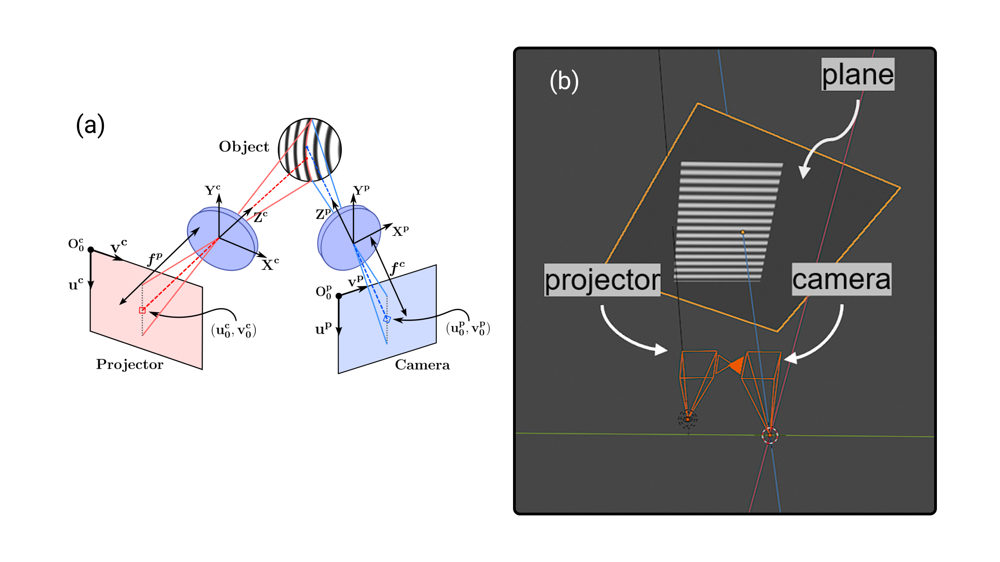

*Imaging Systems and Applications, 2022* 


🔗Paper


### Abstract: 

We propose modeling a structured light system with open-source computer graphics software to perform experimental verifications independently of the physical system. Encouraging experimental results show the capabilities of the digital twin.

### Citation:

*F. J. Quintero, R. Vargas, L. A. Romero, and A. G. Marrugo, "Modeling a Structured Light System with Open-Source Software," in Imaging and Applied Optics Congress 2022 (3D, AOA, COSI, ISA, pcAOP), Technical Digest Series (Optica Publishing Group, 2022), paper JW4C.7.*