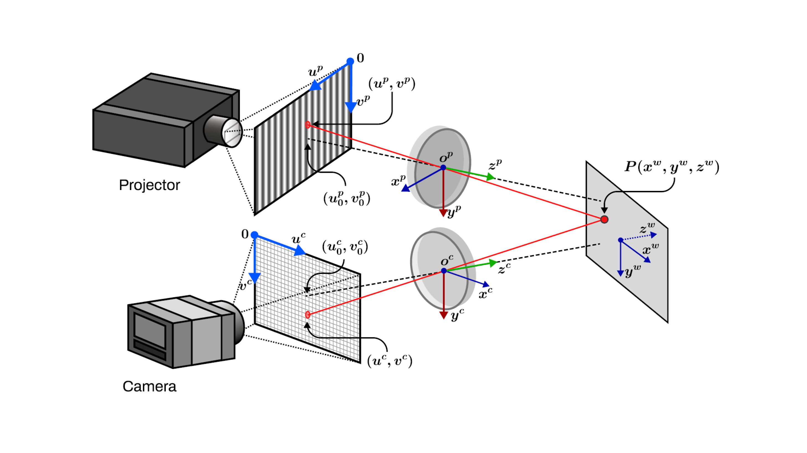

*Proc. SPIE 12527, Pattern Recognition and Tracking XXXIV, 125270P, 2023* 


🔗Paper


### Abstract: 

Improving the accuracy of structured light calibration methods has led to the development of pixel-wise calibration models built on top of conventional pinhole-camera models. Because phase encodes depth and transversal information, the pixel-wise methods provide high flexibility to map phase to XYZ coordinates. However, there are different approaches for producing phase-to-coordinate mapping, and there is no consensus on the most appropriate one. In this study, we highlight the current limitations, especially in depth range and accuracy, of several recent pixel-wise calibration methods, along with experimental performance verifications. The results show that there are opportunities for further improving these methods to overcome existing limitations from conventional calibration methods, particularly for low-cost hardware. 

### Citation:

*Raul Vargas, Fernando Quintero, Lenny A. Romero, and Andres G. Marrugo "Challenges and opportunities in pixel-wise calibration methods for structured light systems", Proc. SPIE 12524, Dimensional Optical Metrology and Inspection for Practical Applications XII , 125240G (15 June 2023); https://doi.org/10.1117/12.2664197*