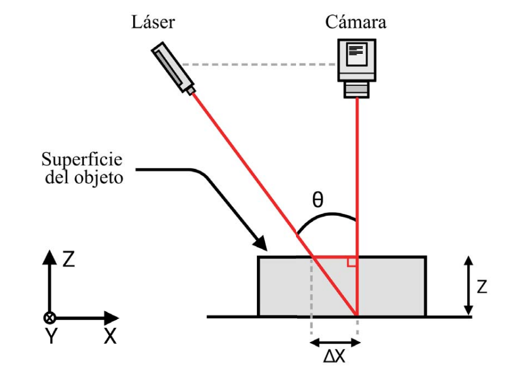

*IX International Congress of Mechatronics Engineering and Automation (CIIMA), 2020*


🔗Paper


### Abstract: 

Profilometers are instruments commonly used in surface metrology tasks. These instruments play a key role in the industry, such as in manufacturing and quality assurance. However, conventional profilometry techniques require direct contact with the object. In this work, we developed a practical and low-cost optical profilometer for contactless profilometry. The proposed profilometer is based on a laser triangulation system. A laser spot is projected onto the surface of an object, which is captured by a camera. The images are processed to detect the laser spot's location and obtain the object's surface height through calibration. We designed and built the translation stage to process the object's surface. Finally, encouraging results show that the profilometer provides high accuracy with fast acquisition.

### Citation:

*Quintero, Fernando J., et al. "Desarrollo e implementación de un perfilómetro óptico por triangulación láser." 2020 IX International Congress of Mechatronics Engineering and Automation (CIIMA). IEEE, 2020.*