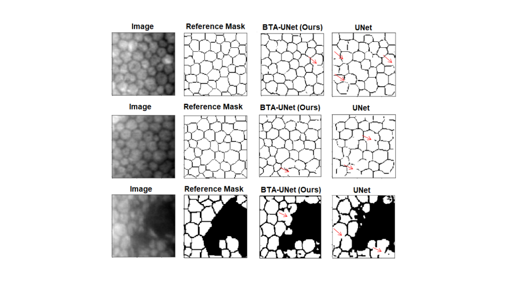

*ColCACI 2023 / Communications in Computer and Information Science, vol 1865. Springer, 2023* 


🔗Paper


### Abstract: 

Computerized medical evaluation of the corneal endothelium is challenging because it requires costly equipment and specialized personnel, not to mention that conventional techniques require manual annotations that are difficult to acquire. This study aims to obtain reliable segmentations without requiring large data sets labeled by expert personnel. To address this problem, we use the Barlow Twins approach to pre-train the encoder of a UNet model in an unsupervised manner. Then, with few labeled data, we train the segmentation. Encouraging results show that it is possible to address the challenge of limited data availability using self-supervised learning. This model achieved a precision of 86%, obtaining a satisfactory performance. Using many images to learn good representations and a few labeled images to learn the semantic segmentation task is feasible.

### Citation:

*Sanchez, S. et al. (2024). Self-supervised Deep-Learning Segmentation of Corneal Endothelium Specular Microscopy Images. In: Orjuela-Cañón, A.D., Lopez, J.A., Arias-Londoño, J.D. (eds) Applications of Computational Intelligence. ColCACI 2023. Communications in Computer and Information Science, vol 1865. Springer, Cham. https://doi.org/10.1007/978-3-031-48415-5_3*